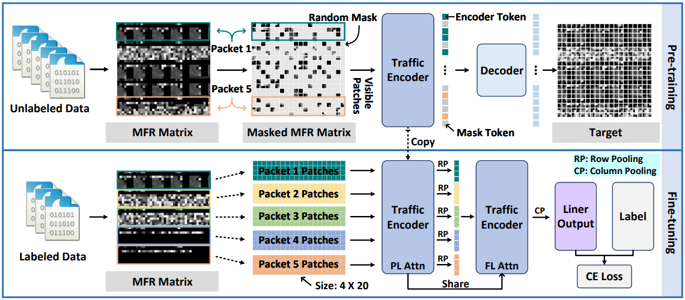

# YaTC

Note: this code is based on [YaTC](https://github.com/NSSL-SJTU/YaTC). Many thanks to the authors. We changed the python file about fine-tuning

This repository contains the code for the paper:
<br>
***Yet Another Traffic Classifier: A Masked Autoencoder Based Traffic Transformer with Multi-Level Flow Representation***
<br>
In Thirty-Seventh AAAI Conference on Artificial Intelligence (AAAI 2023).


## Overview



The training strategy of YaTC is divided into two stages: pre-training stage and fine-tuning stage.

## Dependency

```
python=3.8
timm=0.3.2
torch=1.9.0
numpy=1.19.5
scikit-learn=0.24.2
```

## Fine-tuning

```
python fine-tune.py --blr 2e-3 \
                    --epochs 200 \
                    --data_path ./data/vpn-app/train_val_split_0 \
                    --test_path ./data/vpn-service/test \
                    --output_dir ./outputs \
                    -- log_dir ./logs \
                    --nb_classes 12 \
                    --frozen \
                    --dataset vpn-service

```

## Citation
```
@inproceedings{zhao2023yet,
  title={Yet another traffic classifier: A masked autoencoder based traffic transformer with multi-level flow representation},
  author={Zhao, Ruijie and Zhan, Mingwei and Deng, Xianwen and Wang, Yanhao and Wang, Yijun and Gui, Guan and Xue, Zhi},
  booktitle={Proceedings of the AAAI Conference on Artificial Intelligence},
  volume={37},
  number={4},
  pages={5420--5427},
  year={2023}
}
```

